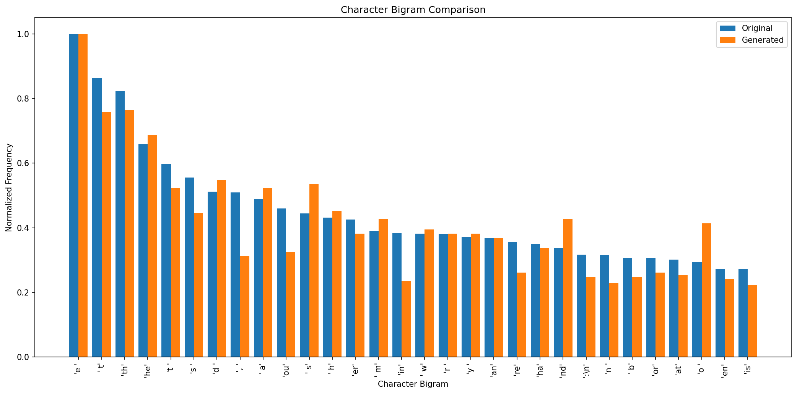

# Character-Level Recurrent Neural Network for Text Generation

## Project Overview

This project implements a **Character-Level Recurrent Neural Network (RNN)** for automatic text generation using the works of William Shakespeare.

The objective is to train deep learning models to learn sequential character patterns from a large text corpus and generate new text character by character. The generated text attempts to reproduce structural patterns found in Shakespeare's writing, including capitalization, punctuation, word formation, spacing, dialogue structure, and common character combinations.

The project primarily uses a **Long Short-Term Memory (LSTM)** network and also implements a **Gated Recurrent Unit (GRU)** model for performance comparison.

Several text-generation strategies are evaluated, including:

- Greedy Sampling
- Temperature Sampling
- Top-k Sampling
- Top-p / Nucleus Sampling

The project also studies the effects of different sequence lengths and temperature values on generated text.

---

# Problem Statement

Traditional recurrent neural networks can process sequential information, but they often experience difficulties when learning long-term dependencies because of problems such as vanishing gradients.

LSTM and GRU networks address this limitation through gating mechanisms that control how information is retained and forgotten.

The goal of this project is to build a character-level language model capable of learning patterns from Shakespeare's works and generating new text based on a user-provided or randomly selected seed sequence.

---

# Objectives

The main objectives of this project are:

1. Load and preprocess the Shakespeare text corpus.
2. Analyze character frequencies and vocabulary.
3. Create character-to-index and index-to-character mappings.
4. Convert text into numerical sequences suitable for deep learning.
5. Train an LSTM-based character-level language model.
6. Implement gradient clipping for stable training.
7. Monitor training and validation performance.
8. Calculate model perplexity.
9. Compare LSTM and GRU architectures.
10. Compare sequence lengths of 50, 100, and 200 characters.
11. Generate text using different temperature values.
12. Implement Greedy, Top-k, and Top-p sampling.
13. Analyze generated character distributions.
14. Compare character bigrams in original and generated text.
15. Visualize LSTM hidden states using t-SNE.
16. Save trained models, checkpoints, results, graphs, and generated samples.

---

# Dataset

The project uses the **Shakespeare Complete Works** text corpus.

The corpus contains approximately one million characters and provides sufficient sequential text for training a character-level recurrent neural network.

The model does not operate directly on complete words. Instead, every individual character is treated as a token.

Examples of tokens include:

```text
a
b
c
A
B
,
.
!
?
(space)
(newline)
```

This allows the model to learn word formation and writing structure directly from sequences of characters.

---

# Project Directory

The project is configured to store its outputs in:

```text
C:\Users\sagni\Downloads\AI_Text_gen
```

A typical project structure is:

```text
AI_Text_gen/
│
├── checkpoints/
│   ├── lstm_epoch_10.weights.h5
│   ├── lstm_epoch_20.weights.h5
│   └── lstm_epoch_30.weights.h5
│
├── generated_samples/
│   ├── epoch_05_sample.txt
│   ├── epoch_10_sample.txt
│   ├── temperature_0.5_sample_1.txt
│   ├── temperature_1.0_sample_1.txt
│   ├── temperature_1.2_sample_1.txt
│   └── ...
│
├── results/
│   ├── character_frequency.csv
│   ├── perplexity_results.csv
│   ├── lstm_vs_gru_comparison.csv
│   ├── sequence_length_experiment.csv
│   ├── temperature_analysis.csv
│   ├── original_vs_generated_frequency.csv
│   ├── character_bigram_analysis.csv
│   ├── hidden_state_tsne.csv
│   └── seed_texts.txt
│
├── shakespeare.txt
├── char2idx.json
├── idx2char.json
├── dataset_info.json
├── config.json
├── final_metrics.json
├── training_history.csv
├── training_history.json
├── lstm_model_summary.txt
├── gru_model_summary.txt
├── analysis_report.txt
├── generated_text_samples.txt
├── sampling_strategy_comparison.txt
│
├── accuracy_graph.png
├── training_validation_loss.png
├── perplexity_graph.png
├── lstm_gru_comparison.png
├── sequence_length_comparison.png
├── temperature_effect_comparison.png
├── original_vs_generated_frequency.png
├── hidden_state_tsne.png
├── character_frequency.png
└── character_bigram_comparison.png
```

Depending on the size-optimized submission configuration, model checkpoints may instead be stored in compressed `.npz` format.

---

# Technologies Used

The project is implemented using **Python** and the following libraries:

- TensorFlow
- Keras
- NumPy
- Pandas
- Matplotlib
- Scikit-learn
- JSON
- Zipfile
- Collections
- OS

---

# Installation

Install the required Python libraries before running the project:

```bash
pip install tensorflow numpy pandas matplotlib scikit-learn
```

Recommended environment:

```text
Python 3.10 / 3.11
TensorFlow 2.x
Jupyter Notebook or VS Code
```

---

# Data Preprocessing

## 1. Text Loading

The Shakespeare corpus is loaded as a UTF-8 text file.

UTF-8 encoding is explicitly used throughout the project to avoid Windows encoding problems when saving text and Keras model summaries.

Example:

```python
with open(TEXT_FILE, "r", encoding="utf-8") as file:
    text = file.read()
```

---

## 2. Character Analysis

The project calculates:

- Total number of characters
- Number of unique characters
- Character frequencies
- Vocabulary size

Character frequencies are stored in:

```text
results/character_frequency.csv
```

and visualized in:

```text
character_frequency.png
```

---

# Character Mapping

Two mappings are created.

## Character to Index

```python
char2idx = {
    character: index
    for index, character in enumerate(characters)
}
```

Example:

```text
'a' -> 40
'b' -> 41
'c' -> 42
```

The mapping is saved as:

```text
char2idx.json
```

---

## Index to Character

The reverse mapping converts predicted numerical values back into characters.

```python
idx2char = {
    index: character
    for character, index in char2idx.items()
}
```

It is saved as:

```text
idx2char.json
```

---

# Sequence Generation

The text is converted into overlapping sequences.

The primary configuration uses:

```text
Sequence Length = 100
Stride = 3
```

For every 100-character input sequence, the model attempts to predict the next character.

Conceptually:

```text
Input:
To be or not to be, that is the questio

Target:
n
```

A stride of 3 means the starting position moves three characters before creating the next training sequence.

---

# Dataset Split

The generated sequences are divided into:

```text
Training Data   = 90%
Validation Data = 10%
```

The training set is used to update model parameters, while validation data is used to evaluate generalization during training.

---

# LSTM Model Architecture

The main model uses a stacked LSTM architecture.

```text
Input Sequence
      │
      ▼
Embedding Layer
Vocabulary → 128 dimensions
      │
      ▼
LSTM
256 units
return_sequences=True
      │
      ▼
Dropout
0.30
      │
      ▼
LSTM
256 units
      │
      ▼
Dropout
0.30
      │
      ▼
Dense Layer
Vocabulary Size
      │
      ▼
Softmax
      │
      ▼
Next Character Prediction
```

The architecture can be summarized as:

```python
Embedding(vocab_size, 128)

LSTM(
    256,
    return_sequences=True
)

Dropout(0.3)

LSTM(256)

Dropout(0.3)

Dense(
    vocab_size,
    activation="softmax"
)
```

---

# Why LSTM?

A basic RNN can have difficulty learning long-term dependencies because gradients may become extremely small during backpropagation.

LSTM networks introduce gating mechanisms that regulate information flow.

The important components include:

- Input Gate
- Forget Gate
- Output Gate
- Cell State
- Hidden State

These mechanisms allow the network to preserve useful information over longer character sequences.

---

# GRU Model

A GRU model is also trained to compare another gated recurrent architecture with LSTM.

The GRU architecture follows a similar structure:

```text
Embedding
    ↓
GRU 256
    ↓
Dropout
    ↓
GRU 256
    ↓
Dropout
    ↓
Dense Softmax
```

GRU generally uses fewer gating operations than LSTM and therefore typically requires fewer parameters for comparable hidden dimensions.

The comparison results are stored in:

```text
results/lstm_vs_gru_comparison.csv
```

Visualization:

```text
lstm_gru_comparison.png
```

---

# Training Configuration

The primary training configuration is:

| Parameter | Value |
|---|---|
| Optimizer | Adam |
| Learning Rate | 0.001 |
| Batch Size | 128 |
| Maximum Epochs | 30 |
| Sequence Length | 100 |
| Stride | 3 |
| Embedding Dimension | 128 |
| LSTM Hidden Units | 256 |
| Dropout | 0.30 |
| Gradient Clip Norm | 5.0 |
| Training Split | 90% |
| Validation Split | 10% |

---

# Loss Function

The project uses:

```text
Sparse Categorical Cross-Entropy
```

This is appropriate because the target character is represented using an integer class index rather than a one-hot encoded vector.

---

# Optimizer

The model uses the Adam optimizer:

```python
Adam(
    learning_rate=0.001,
    clipnorm=5.0
)
```

Adam dynamically adjusts the effective learning rate for individual parameters during training.

---

# Gradient Clipping

Gradient clipping is used to improve recurrent-network training stability.

```python
clipnorm=5.0
```

If the gradient norm becomes excessively large, clipping prevents it from exceeding the configured threshold.

This helps reduce the effect of exploding gradients.

---

# Early Stopping

Early stopping monitors:

```text
validation loss
```

If validation performance stops improving for several epochs, training can stop automatically.

The best model weights are restored using:

```python
restore_best_weights=True
```

This prevents unnecessary training after the model has stopped improving.

---

# Learning Rate Reduction

The project also uses:

```text
ReduceLROnPlateau
```

If validation loss stops improving, the learning rate is reduced.

This can help the optimizer make smaller parameter updates when approaching a useful minimum.

---

# Model Checkpoints

Checkpoints are created during training.

The important submission checkpoints are:

```text
Epoch 10
Epoch 20
Epoch 30
Final Model
```

To satisfy the submission-size requirement, unnecessary duplicate checkpoints can be removed.

A size-optimized version may use compressed model weights.

---

# Perplexity

Perplexity is calculated from the cross-entropy loss:

```text
Perplexity = exp(Loss)
```

Lower perplexity generally indicates that the language model assigns higher probability to the observed validation characters.

Perplexity results are saved in:

```text
results/perplexity_results.csv
```

Visualization:

```text
perplexity_graph.png
```

---

# Text Generation

After training, the model generates text character by character.

The generation process is:

```text
Seed Text
    ↓
Convert Characters to Indices
    ↓
LSTM Prediction
    ↓
Probability Distribution
    ↓
Sampling Strategy
    ↓
Predicted Character
    ↓
Append Character to Sequence
    ↓
Repeat
```

A typical generation length is:

```text
500 characters
```

---

# Seed Text

Generation begins using an initial sequence known as the **seed**.

The project can select seeds randomly from the original Shakespeare corpus.

Ten seed sequences are saved in:

```text
results/seed_texts.txt
```

The model also supports custom user-provided seed text.

---

# Temperature Sampling

Temperature modifies the probability distribution before selecting the next character.

The project evaluates:

```text
0.2
0.5
1.0
1.2
```

---

## Temperature 0.2

Very low temperature strongly favors characters with high predicted probabilities.

Typical behavior:

- More conservative
- More repetitive
- Lower randomness
- More predictable patterns

---

## Temperature 0.5

A moderate-low temperature usually provides a useful balance between structure and variation.

Typical behavior:

- Relatively stable spelling
- Good character patterns
- Moderate creativity
- Lower randomness

---

## Temperature 1.0

At temperature 1.0, sampling follows the model's learned probability distribution without additional sharpening or flattening.

Typical behavior:

- Increased variation
- Greater diversity
- More creative combinations

---

## Temperature 1.2

Higher temperature flattens the probability distribution.

Typical behavior:

- Greater randomness
- More unusual character combinations
- Higher diversity
- Greater possibility of spelling or structural errors

---

# Required Generated Samples

The project generates:

```text
10 samples at Temperature 0.5
10 samples at Temperature 1.0
10 samples at Temperature 1.2
```

Each generated sample contains approximately:

```text
500 characters
```

Therefore, the primary experiment produces at least:

```text
30 generated text samples
```

The samples are stored in:

```text
generated_samples/
```

A combined version is available in:

```text
generated_text_samples.txt
```

---

# Sampling Strategies

The project implements four main sampling approaches.

## 1. Greedy Sampling

Greedy sampling always selects the character with the highest predicted probability.

```python
next_index = np.argmax(probabilities)
```

Advantages:

- Deterministic
- Simple
- Stable

Limitation:

- Can become repetitive

---

# 2. Temperature Sampling

Temperature sampling modifies the probability distribution before randomly selecting the next character.

It allows control over the balance between predictability and diversity.

---

# 3. Top-k Sampling

Top-k sampling limits character selection to only the `k` characters with the highest predicted probabilities.

The project evaluates:

```text
Top-k = 5
Top-k = 10
```

This prevents extremely unlikely characters from being selected.

---

# 4. Top-p Sampling

Top-p sampling is also known as **nucleus sampling**.

Instead of selecting a fixed number of characters, it selects the smallest set of characters whose cumulative probability reaches a threshold.

The project uses:

```text
p = 0.9
```

This creates a dynamically sized candidate set depending on the model's confidence.

---

# Sampling Strategy Comparison

The project compares:

```text
Greedy
Temperature 1.0
Top-k 5
Top-k 10
Top-p 0.9
```

Generated outputs are stored in:

```text
sampling_strategy_comparison.txt
```

---

# Sequence Length Experiment

The project evaluates three input sequence lengths:

```text
50
100
200
```

The purpose is to examine how the amount of previous context affects prediction performance.

Results are saved in:

```text
results/sequence_length_experiment.csv
```

Visualization:

```text
sequence_length_comparison.png
```

---

# Character Frequency Analysis

Character distributions in the original and generated text are compared.

The purpose is to determine whether the generated text approximately reproduces the statistical character patterns of the training corpus.

Results:

```text
results/original_vs_generated_frequency.csv
```

Visualization:

```text
original_vs_generated_frequency.png
```

---

# Character Bigram Analysis

A **bigram** consists of two consecutive characters.

Examples include:

```text
th
he
in
er
re
(space)t
```

Character bigram analysis helps evaluate whether the generated text learns local character relationships from the original Shakespeare corpus.

The most common bigrams from the original corpus are compared with their occurrence in generated text.

Results are saved in:

```text
results/character_bigram_analysis.csv
```

---

# Character Bigram Visualization

The following graph compares normalized character-bigram frequencies between the **original Shakespeare corpus** and the **generated text**.



The visualization helps identify whether the trained LSTM reproduces common local character patterns found in the training corpus.

A stronger similarity between the distributions suggests that the model has learned important short-range relationships between characters.

However, bigram similarity alone does not prove that generated sentences are grammatically or semantically correct. It is primarily an analysis of local character-level patterns.

---

# Hidden-State Visualization

The internal hidden representation of the LSTM is analyzed using **t-Distributed Stochastic Neighbor Embedding (t-SNE)**.

The hidden states from the second LSTM layer are extracted for validation sequences.

Since these states contain many dimensions, t-SNE reduces them to two dimensions for visualization.

Output data:

```text
results/hidden_state_tsne.csv
```

Visualization:

```text
hidden_state_tsne.png
```

This analysis provides an exploratory view of how different sequence contexts are represented inside the recurrent network.

---

# Training and Validation Loss

Training and validation loss are recorded for every epoch.

Visualization:

```text
training_validation_loss.png
```

The graph helps identify:

- Learning progress
- Convergence
- Underfitting
- Potential overfitting
- Differences between training and validation behavior

---

# Accuracy Analysis

Character-prediction accuracy is recorded during training.

Visualization:

```text
accuracy_graph.png
```

Because this is a next-character language-modeling problem, accuracy represents the proportion of validation positions for which the model's highest-probability character matches the actual next character.

---

# Perplexity Analysis

The project calculates training and validation perplexity throughout training.

Visualization:

```text
perplexity_graph.png
```

Perplexity provides another useful measure of the model's uncertainty when predicting the next character.

---

# LSTM vs GRU Analysis

The LSTM and GRU models are evaluated using:

- Validation Loss
- Validation Accuracy
- Perplexity
- Number of Parameters

Results:

```text
results/lstm_vs_gru_comparison.csv
```

Visualization:

```text
lstm_gru_comparison.png
```

The experiment makes it possible to compare two widely used gated recurrent architectures under similar conditions.

The actual CSV metrics should be used when determining which architecture performed better in a particular training run.

---

# Temperature Diversity Analysis

Different temperature settings are analyzed to observe changes in generated-text diversity.

Results:

```text
results/temperature_analysis.csv
```

Visualization:

```text
temperature_effect_comparison.png
```

In general, increasing temperature increases randomness in the sampling process.

Lower temperatures concentrate probability on highly likely characters, while higher temperatures allow lower-probability characters to be selected more frequently.

---

# Generated Text Characteristics

After training, the model may learn patterns such as:

- Capitalization
- Spaces
- Newlines
- Punctuation
- Frequent character combinations
- Common word fragments
- Common words
- Dialogue-like formatting
- Shakespeare-like structural patterns

Because this is a character-level model, the network is not provided with explicit knowledge of words or grammar.

These patterns emerge from the sequential character data used during training.

---

# Advantages of Character-Level Modeling

Character-level models have several advantages:

1. No tokenizer is required.
2. Vocabulary size remains small.
3. Unknown words are not a problem.
4. The model can generate previously unseen words.
5. Punctuation can be learned directly.
6. Capitalization patterns can be learned.
7. The model can learn stylistic character patterns.

---

# Limitations

The project also has several limitations.

## Semantic Consistency

The model may generate text that looks structurally correct while lacking meaningful long-term context.

## Training Time

Stacked LSTM networks can require significant computation, particularly when trained on CPU.

## Long-Term Dependencies

Although LSTM improves upon vanilla RNNs, maintaining consistent meaning over very long generated passages remains difficult.

## Character-Level Learning

The network must independently learn:

```text
characters → words → phrases → sentence patterns
```

This can require more sequential steps than word-level modeling.

## Sampling Sensitivity

Generated text quality can change substantially depending on the selected temperature and sampling strategy.

---

# Model Size Optimization

The final project is designed so that it can be compressed for submission under a **50 MB ZIP limit**.

To reduce submission size:

- Unnecessary intermediate checkpoints can be removed.
- Only important checkpoints are retained.
- Duplicate model files are removed.
- GRU comparison results can be retained without storing duplicate large model files.
- Temporary files are removed.
- Nested ZIP files are excluded.
- Model weights can optionally be stored using compressed formats.

Important checkpoints include:

```text
Epoch 10
Epoch 20
Epoch 30
Final LSTM Model
```

---

# Main Output Files

## Model and Configuration

```text
char2idx.json
idx2char.json
dataset_info.json
config.json
final_metrics.json
lstm_model_summary.txt
gru_model_summary.txt
```

## Training Results

```text
training_history.csv
training_history.json
perplexity_results.csv
lstm_vs_gru_comparison.csv
sequence_length_experiment.csv
temperature_analysis.csv
```

## Generated Text

```text
generated_text_samples.txt
sampling_strategy_comparison.txt
generated_samples/
```

## Analysis Results

```text
character_frequency.csv
original_vs_generated_frequency.csv
character_bigram_analysis.csv
hidden_state_tsne.csv
```

## Visualizations

```text
character_frequency.png
training_validation_loss.png
accuracy_graph.png
perplexity_graph.png
lstm_gru_comparison.png
sequence_length_comparison.png
temperature_effect_comparison.png
original_vs_generated_frequency.png
hidden_state_tsne.png
character_bigram_comparison.png
```

---

# How to Run the Project

## Step 1: Install Dependencies

```bash
pip install tensorflow numpy pandas matplotlib scikit-learn
```

## Step 2: Open the Project

The project can be executed using:

```text
Jupyter Notebook
VS Code
Python IDE
```

## Step 3: Run the Training Code

Execute the cells/scripts in sequence.

The program will:

```text
Load Dataset
      ↓
Analyze Characters
      ↓
Create Character Mappings
      ↓
Encode Text
      ↓
Create Training Sequences
      ↓
Split Training/Validation Data
      ↓
Build LSTM
      ↓
Train LSTM
      ↓
Evaluate LSTM
      ↓
Train/Evaluate GRU
      ↓
Compare Models
      ↓
Generate Text
      ↓
Analyze Temperature
      ↓
Analyze Character Frequencies
      ↓
Analyze Bigrams
      ↓
Visualize Hidden States
      ↓
Save Results
```

---

# Using a Custom Seed

After the model has been trained, text can be generated from custom seed text.

Example:

```python
generated = generate_text(
    lstm_model,
    "ROMEO: What light through yonder window",
    length=500,
    temperature=0.8,
    strategy="temperature"
)

print(generated)
```

The seed is converted to character indices and used as the initial context for generation.

---

# Example Top-k Generation

```python
generated = generate_text(
    lstm_model,
    seed_texts[0],
    length=500,
    temperature=1.0,
    strategy="top_k",
    top_k=5
)

print(generated)
```

---

# Example Top-p Generation

```python
generated = generate_text(
    lstm_model,
    seed_texts[0],
    length=500,
    temperature=1.0,
    strategy="top_p",
    top_p=0.9
)

print(generated)
```

---

# Evaluation Metrics

The project primarily evaluates the models using:

## Validation Loss

Measures the cross-entropy error on validation sequences.

Lower values indicate better predictive performance.

## Validation Accuracy

Measures how often the model's most probable next character matches the actual next character.

Higher values indicate better next-character classification accuracy.

## Perplexity

Calculated as:

```text
Perplexity = exp(Validation Loss)
```

Lower perplexity indicates lower uncertainty in predicting validation characters.

## Character Distribution

Compares original and generated character frequencies.

## Bigram Distribution

Compares two-character combinations in original and generated text.

## Diversity

Measures variation in generated characters and character bigrams.

---

# Expected Performance

Performance depends on:

- Number of training epochs
- Hardware
- Random initialization
- Sequence length
- Corpus size
- Batch size
- Hidden dimensions
- Learning rate

As a general assignment target:

```text
Validation Loss < 1.5  → Good
Validation Loss < 1.2  → Excellent

Perplexity < 5         → Good
Perplexity < 4         → Excellent
```

Actual results should always be taken from the generated `final_metrics.json` and CSV files rather than assumed from these target values.

---

# Key Observations

The project demonstrates several important properties of character-level language modeling.

### 1. LSTM can learn character dependencies

The network learns recurring character combinations, punctuation patterns, capitalization, spacing, and common word structures directly from raw text.

### 2. Temperature significantly affects generation

Lower temperatures tend to produce more conservative outputs, while higher temperatures introduce greater variation.

### 3. Sampling strategy matters

Greedy decoding can become repetitive, whereas Top-k and Top-p sampling can provide more varied generation by allowing multiple plausible characters to be selected.

### 4. Sequence length changes the available context

Shorter sequences reduce computational requirements, while longer sequences provide additional historical context at greater computational cost.

### 5. Character statistics provide useful evidence

Frequency and bigram comparisons help determine whether the generated text reproduces local statistical properties of the original corpus.

### 6. LSTM and GRU provide alternative recurrent architectures

Both models can perform next-character prediction, but they differ in architecture and parameterization. Their actual performance is compared using the experiment results generated by this project.

---

# Future Improvements

The project can be extended using:

1. Attention mechanisms
2. Three-layer LSTM networks
3. Bidirectional models for non-autoregressive analysis tasks
4. Larger training datasets
5. Word-level language modeling
6. Subword tokenization
7. Transformer architectures
8. Hyperparameter optimization
9. Beam search
10. Web-based text-generation interface
11. Rhyme analysis
12. Additional literary datasets

---

# Conclusion

This project demonstrates the complete implementation of a **Character-Level Recurrent Neural Network for Text Generation** using Shakespeare's works.

The system performs text preprocessing, character encoding, sequence generation, LSTM training, GRU comparison, perplexity evaluation, sequence-length experiments, multiple sampling strategies, temperature analysis, character-frequency comparison, bigram analysis, and hidden-state visualization.

The primary LSTM model learns statistical and sequential patterns directly from individual characters without explicit word-level tokenization.

The `character_bigram_comparison.png` visualization provides a useful comparison between local character patterns in the original Shakespeare corpus and those reproduced by the generated text.

Overall, the project demonstrates how recurrent neural networks can learn sequential language patterns and use those patterns to generate new text character by character.

---

# Main Visualization


**Figure:** Comparison of normalized character-bigram frequencies in the original Shakespeare corpus and LSTM-generated text.

---

# Project Summary

```text
Project:
Character-Level Recurrent Neural Network for Text Generation

Primary Model:
LSTM

Comparison Model:
GRU

Dataset:
Shakespeare Complete Works

Sequence Length:
100

Stride:
3

Embedding Dimension:
128

Hidden Units:
256

Batch Size:
128

Optimizer:
Adam

Learning Rate:
0.001

Gradient Clipping:
5.0

Main Sampling Methods:
Greedy
Temperature
Top-k
Top-p

Temperature Values:
0.2
0.5
1.0
1.2

Main Visualization:
character_bigram_comparison.png

Submission Goal:
Compressed project ZIP below 50 MB
```

---

# Author

Developed as a deep learning project for **Character-Level Text Generation using Recurrent Neural Networks**.
